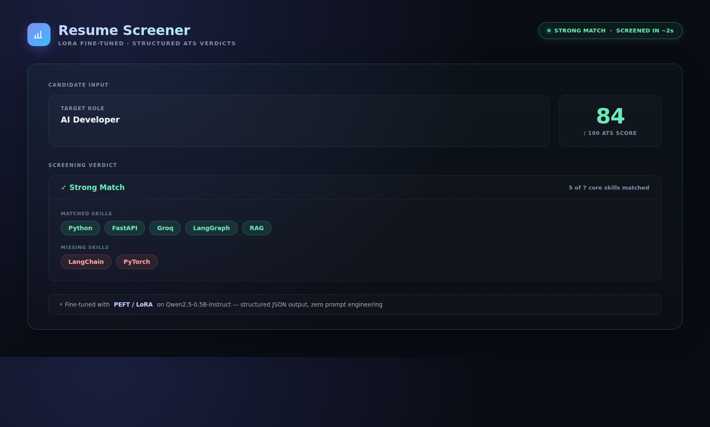

# Resume Screener — LoRA Fine-Tuned (Qwen2.5-0.5B)
[](https://resume-screener-lora.streamlit.app/)
[](LICENSE)
[](requirements.txt)
[](https://github.com/ayush-s-tomar/resume-screener-lora/actions/workflows/eval.yml)

Fine-tuned Qwen2.5-0.5B-Instruct using LoRA to output structured JSON verdicts
for resume screening, instead of relying on prompting alone.

**[Try the live demo →](https://resume-screener-lora.streamlit.app/)**
*(hosted on Streamlit Community Cloud — may take 30–60s to wake up on first use)*


## Demo

https://github.com/user-attachments/assets/3328d75d-4e17-41aa-95d9-09d8749e6c41



---

## Why

Prompting a base instruct model for resume screening produces unstructured,
inconsistent prose — not something you can pipe into an ATS or scoring
pipeline. This project fine-tunes a small open model so structured JSON
output becomes the model's default behavior, not something you have to
coax out with prompt engineering.

---

## Approach

- Base model: Qwen2.5-0.5B-Instruct
- Method: LoRA (r=16, alpha=32, dropout=0.05) targeting q/k/v/o projections
- Trainable params: 2,162,688 / 496,195,456 total (**0.44%**) — the whole point of LoRA: near-full fine-tuning quality by training a tiny fraction of the weights, on a free-tier GPU, in a fraction of the time
- Dataset: 800 train / 96 eval examples, resume text -> structured JSON verdict
- 3 epochs on a free Colab T4 GPU

---

## Results

| Epoch | Training Loss | Validation Loss |
|-------|--------------|------------------|
| 1     | 0.4078       | 0.2784           |
| 2     | 0.1956       | 0.1883           |
| 3     | 0.1713       | 0.1714           |

Validation loss tracked training loss closely with no divergence — no overfitting, meaning the model learned the JSON-verdict structure and screening logic in a way that generalizes, rather than memorizing the training examples.

Full training run is in [`finetune_lora.ipynb`](finetune_lora.ipynb).

---

## Before vs After

**Prompt:** Screen this resume for a Backend Engineer position and return a
structured verdict. Resume: Bachelor's in CS, 4 years distributed backend
experience, skilled in Python, PostgreSQL, Docker, Kubernetes.

**Base model (no fine-tuning):** unstructured prose with markdown headers
(Summary, Key Skills, Experience) — not machine-parseable.

**Fine-tuned model:**
```json
{"role": "Backend Engineer", "ats_score": 57, "verdict": "moderate_match", "matched_skills": ["Python", "PostgreSQL", "Docker", "Kubernetes"], "missing_skills": ["Java", "REST APIs", "Redis"], "years_experience": 4}
```

---

## Run Locally

```bash
# 1. Clone
git clone https://github.com/ayush-s-tomar/resume-screener-lora.git
cd resume-screener-lora

# 2. Install dependencies
python -m venv venv
source venv/bin/activate        # Windows: venv\Scripts\activate
pip install -r requirements.txt

# 3. Run inference directly (CLI)
python inference.py

# 4. Or launch the Streamlit app
streamlit run app.py
# → http://localhost:8501

# 5. (Optional) Compare base vs fine-tuned model output side by side
python compare_baseline_vs_finetuned.py
```

No API keys required — inference runs locally against the LoRA adapter in
`resume-screener-lora-adapter/`, loaded on top of the base Qwen2.5-0.5B-Instruct
model from Hugging Face.

---

## Repo Structure

```
resume-screener-lora/
├── finetune_lora.ipynb                # Full training notebook (data prep → LoRA config → training → eval)
├── inference.py                       # CLI inference script — loads adapter, runs a single screening
├── app.py                             # Streamlit app — the live demo UI
├── compare_baseline_vs_finetuned.py   # Side-by-side base vs fine-tuned output comparison
├── data/                              # Train/eval JSONL datasets + dataset generator script
├── resume-screener-lora-adapter/      # Trained LoRA adapter weights
├── assets/                            # Demo GIF and screenshot
├── .github/workflows/                 # CI eval workflow — runs on push/PR
├── requirements.txt
├── LICENSE
└── README.md
```

---

## Stack

PEFT/LoRA, Hugging Face Transformers, TRL, PyTorch, Streamlit, Colab T4 GPU

---

## 🤝 Contributing

Contributions, issues, and feature requests are welcome! Feel free to check the [issues page](https://github.com/ayush-s-tomar/resume-screener-lora/issues).

1. Fork the project
2. Create your feature branch (`git checkout -b feature/amazing-feature`)
3. Commit your changes (`git commit -m 'Add some amazing feature'`)
4. Push to the branch (`git push origin feature/amazing-feature`)
5. Open a Pull Request

## 📄 License

Distributed under the MIT License. See [`LICENSE`](LICENSE) for more information.

## 🙋 Author

**Ayush Singh Tomar** — [GitHub](https://github.com/ayush-s-tomar)

*Part of my AI developer portfolio — agents and models that do real, measurable work. See also: [SalesAgent](https://github.com/ayush-s-tomar/salesagent), an autonomous B2B lead-research and outreach agent.*
