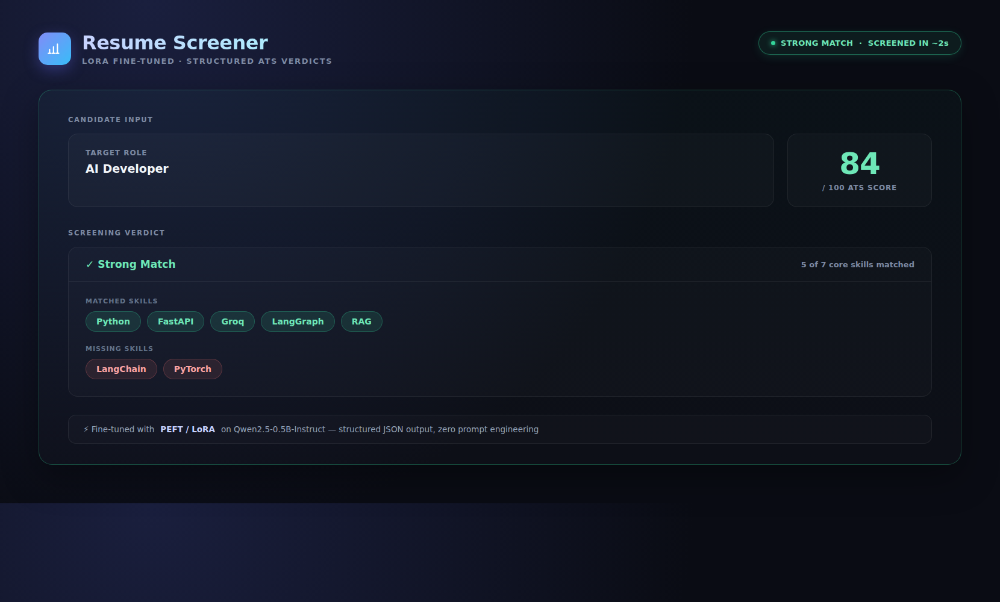

# Resume Screener — LoRA Fine-Tuned (Qwen2.5-0.5B)
[](https://resume-screener-finetune.onrender.com/)
[](LICENSE)
[](requirements.txt)
[](https://github.com/ayush-s-tomar/resume-screener-lora/actions/workflows/eval.yml)

Fine-tuned Qwen2.5-0.5B-Instruct using LoRA to output structured JSON verdicts
for resume screening, instead of relying on prompting alone.

**[Try the live demo →](https://resume-screener-finetune.onrender.com/)**
*(hosted on Render free tier — may take 20–30s to wake up on first use. See [Deployment Note](#deployment-note) for how the demo backend differs from the trained model.)*


## Demo

https://github.com/user-attachments/assets/3328d75d-4e17-41aa-95d9-09d8749e6c41



---

## Why

Prompting a base instruct model for resume screening produces unstructured,
inconsistent prose — not something you can pipe into an ATS or scoring
pipeline. This project fine-tunes a small open model so structured JSON
output becomes the model's default behavior, not something you have to
coax out with prompt engineering.

---

## Approach

- Base model: Qwen2.5-0.5B-Instruct
- Method: LoRA (r=16, alpha=32, dropout=0.05) targeting q/k/v/o projections
- Trainable params: 2,162,688 / 496,195,456 total (**0.44%**) — the whole point of LoRA: near-full fine-tuning quality by training a tiny fraction of the weights, on a free-tier GPU, in a fraction of the time
- Dataset: 800 train / 96 eval examples, resume text -> structured JSON verdict
- 3 epochs on a free Colab T4 GPU

Full training run is in [`finetune_lora.ipynb`](finetune_lora.ipynb).

---

## Results

| Epoch | Training Loss | Validation Loss |
|-------|--------------|------------------|
| 1     | 0.4078       | 0.2784           |
| 2     | 0.1956       | 0.1883           |
| 3     | 0.1713       | 0.1714           |

Validation loss tracked training loss closely with no divergence — no overfitting, meaning the model learned the JSON-verdict structure and screening logic in a way that generalizes, rather than memorizing the training examples.

**Before vs After**

**Prompt:** Screen this resume for a Backend Engineer position and return a
structured verdict. Resume: Bachelor's in CS, 4 years distributed backend
experience, skilled in Python, PostgreSQL, Docker, Kubernetes.

**Base model (no fine-tuning):** unstructured prose with markdown headers
(Summary, Key Skills, Experience) — not machine-parseable.

**Fine-tuned model:**
```json
{"role": "Backend Engineer", "ats_score": 57, "verdict": "moderate_match", "matched_skills": ["Python", "PostgreSQL", "Docker", "Kubernetes"], "missing_skills": ["Java", "REST APIs", "Redis"], "years_experience": 4}
```

*CI note: the eval workflow above validates the training/eval pipeline in this repo, not the hosted demo backend described below.*

---

## Run Locally (Fine-Tuned Adapter)

```bash
git clone https://github.com/ayush-s-tomar/resume-screener-lora.git
cd resume-screener-lora

python -m venv venv
source venv/bin/activate        # Windows: venv\Scripts\activate
pip install -r requirements.txt

python inference.py              # CLI inference
streamlit run app.py             # -> http://localhost:8501

python compare_baseline_vs_finetuned.py   # optional: base vs fine-tuned side by side
```

No API keys required — runs against the LoRA adapter in
`resume-screener-lora-adapter/`, loaded on top of the base
Qwen2.5-0.5B-Instruct model from Hugging Face.

---

## Repo Structure
resume-screener-lora/
├── finetune_lora.ipynb # Full training notebook (data prep -> LoRA config -> training -> eval)
├── inference.py # CLI inference script -- loads adapter, runs a single screening
├── app.py # Streamlit app -- local demo UI using the actual fine-tuned adapter
├── compare_baseline_vs_finetuned.py # Side-by-side base vs fine-tuned output comparison
├── data/ # Train/eval JSONL datasets + dataset generator script
├── resume-screener-lora-adapter/ # Trained LoRA adapter weights
├── render-deploy/ # Hosted demo backend (see render-deploy/README.md)
├── assets/ # Demo GIF and screenshot
├── .github/workflows/ # CI eval workflow -- runs on push/PR
├── requirements.txt
├── LICENSE
└── README.md

---

## Deployment Note

The **trained LoRA adapter** (above) is the actual research artifact and runs
fully locally with no API key. The **hosted live demo** link instead serves
scoring through Groq's API (`openai/gpt-oss-20b`), not the local
GGUF-quantized adapter -- a deliberate substitution after hitting repeated
OOM/timeout failures running llama.cpp inference on Render's free tier
(512MB RAM ceiling). This keeps the public demo link fast and reliably
hostable without misrepresenting the training results above, which reflect
the real fine-tuned model.

Details and setup for the hosted backend live in
[`render-deploy/README.md`](render-deploy/README.md).

---

## Stack

**Fine-tuning:** PEFT/LoRA, Hugging Face Transformers, TRL, PyTorch, Colab T4 GPU
**Local demo:** Streamlit
**Hosted demo backend:** FastAPI, Groq API, Render

---

## Contributing

Contributions, issues, and feature requests are welcome! Feel free to check the [issues page](https://github.com/ayush-s-tomar/resume-screener-lora/issues).

1. Fork the project
2. Create your feature branch (`git checkout -b feature/amazing-feature`)
3. Commit your changes (`git commit -m 'Add some amazing feature'`)
4. Push to the branch (`git push origin feature/amazing-feature`)
5. Open a Pull Request

## License

Distributed under the MIT License. See [`LICENSE`](LICENSE) for more information.

## Author

**Ayush Singh Tomar** — [GitHub](https://github.com/ayush-s-tomar)

*Part of my AI developer portfolio -- agents and models that do real, measurable work. See also: [SalesAgent](https://github.com/ayush-s-tomar/salesagent), an autonomous B2B lead-research and outreach agent.*
